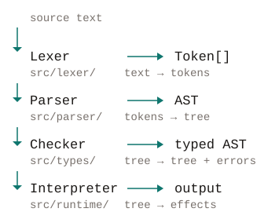

# Vela


A small statically-typed language and its compiler, written in TypeScript.

Vela exists to be read. Every stage of the pipeline — lexer, parser, type
checker, interpreter — is a separate module with no back-references to the
stages before it, and the whole thing is about 4,400 lines of TypeScript. If you
want to understand how a compiler fits together, reading this one end to end is
a reasonable way to spend an afternoon.



<details>
<summary>As text</summary>

```
source text
   │
   ▼
Lexer ────────▶ Token[]          src/lexer/       text  →  tokens
   │
   ▼
Parser ───────▶ AST              src/parser/      tokens  →  tree
   │
   ▼
Checker ──────▶ typed AST        src/types/       tree  →  tree + errors
   │
   ▼
Interpreter ──▶ output           src/runtime/     tree  →  effects
```

</details>

Each stage appends to a shared `DiagnosticBag` and the pipeline stops after the
first stage that reported errors, because there is no point type-checking a tree
the parser did not fully understand.

## Install

```console
$ npm install --global vela-lang
$ echo 'print("hello from Vela");' > hello.vela
$ vela run hello.vela
hello from Vela
```

`vela-lang` also installs itself as `vela`, so the two names are
interchangeable. Without installing:

```console
$ npx vela-lang run hello.vela
```

To embed the compiler in something else, install it as a library instead. The
package has no runtime dependencies, and every stage is exported separately so a
host can stop early:

```js
import { compile, Interpreter, createGlobalEnvironment }
  from "vela-lang";

const result = compile("example.vela", 'print("hi");');
if (result.stage === "ok") {
  new Interpreter(createGlobalEnvironment()).run(result.program);
}
```

## Quick start

To work on Vela itself, from a clone:

```console
$ npm install
$ npm run vela -- run examples/hello.vela
hello, world

$ npm run vela -- repl
vela> 40 + 2;
42
vela> .exit
```

## The language

Vela is imperative and C-like. Every type is written down: variables, function
parameters, and return types are all annotated, and nothing is inferred.

```vela
fn fizzbuzz(n: number): string {
    if (n % 15 == 0) { return "FizzBuzz"; }
    if (n % 3 == 0) { return "Fizz"; }
    if (n % 5 == 0) { return "Buzz"; }
    return tostring(n);
}

for (let i: number = 1; i <= 20; i = i + 1) {
    print(fizzbuzz(i));
}
```

There are four primitive types — `number`, `string`, `bool`, and `void` — plus the
bare `function` type, fixed-length arrays written `T[]`, a nullable written `T?`
with `null` as its absence, and one user-defined type, the `struct`. There are no
modules, no classes, and no unions. That is a deliberate constraint: the point is
to keep the pipeline legible, and every one of those features is a chapter's worth
of design on its own.

```vela
let xs: number[] = [3, 1, 2];
let i: number = 0;
while (i < len(xs) - 1) {              // no for ... of, no sort
    if (xs[i] > xs[i + 1]) {
        let swap: number = xs[i];      // an array is a reference, so this works
        xs[i] = xs[i + 1];
        xs[i + 1] = swap;
    }
    i = i + 1;
}
print(xs);                             // [1, 2, 3]
```

```vela
struct Node { value: number; next: Node?; }   // a nullable field breaks the cycle

fn sum(head: Node?): number {
    let total: number = 0;
    for (let at: Node? = head; at != null; at = at.next) {
        total = total + at.value;               // `at` is a `Node` here, not an error
    }
    return total;
}
print(sum(Node(1, Node(2, null))));             // 3
```

```vela
struct Config { retries: number; label?: string; }   // a `?` after the *name*

let c: Config = Config(3);                     // the label is optional: null
print(tostring(c == Config(3, null)));         // true: omission *is* null
if (c.label != null) { print(c.label); }       // narrowed, like any other `T?`
```

Eight things that used to be impossible are not any more: `s[i]` indexes a string,
`xs[i]` reads and writes one element of an array, `append(xs, v)` is the one way to
make an array longer, `trunc`/`floor`/`ceil`/`round`/`abs`/`min`/`max`/`idiv` are
built in, functions can be stored and passed as `function` values, forward and
mutual recursion work, `T?` records that a value may be absent — narrowed by a
`!= null` test, per branch, which is what makes a struct able to refer to itself —
and a `field?: T` may be left out of a struct's constructor entirely.

The full grammar is in [`docs/grammar.md`](docs/grammar.md), and
[`docs/SKILLS.md`](docs/SKILLS.md) is the same language organised for writing
code rather than reading it — a table of what does *not* exist in Vela and what to
write instead, the standard library recipes that stand in for the missing
math and string functions, the full diagnostic catalogue, and a checklist to run
before calling a program correct. It is the file to hand an AI model, and it is
worth reading before the grammar if you are here to write Vela rather than to
study the compiler.

The rules worth knowing before reading any other code:

- **Statements end with `;`.** There is no newline sensitivity.
- **Types are mandatory.** `let x = 1;` is an error; write `let x: number = 1;`.
- **Conditions must be `bool`.** No truthiness.
- **Functions may be used before they are written.** Signatures are hoisted
  before any body is checked, so forward references and mutual recursion both
  work. Variables are not hoisted: a `let` must be declared before use.
- **Short-circuiting is real.** `&&` and `||` evaluate the right side only when
  they must, and `&& false && (1 / 0 == 0)` is a perfectly safe expression.
- **`++` and `--` are statements.** They have no value, so `i++;` and
  `for (...; i++)` work but `let y: number = i++;` does not. A leading `--` is
  still a doubled negation, so `--1` is `1`.

### Built-in functions

| Function | Signature | Notes |
| --- | --- | --- |
| `tostring(x)` | `(any) -> string` | Numbers render without a decimal point. |
| `tonumber(s)` | `(any) -> number` | Returns `0` if the string is not numeric, or for any non-string. |
| `typeOf(x)` | `(any) -> string` | Returns `"number"`, `"string"`, `"bool"`, `"void"`, `"function"`, or `"native"`. |
| `len(s)` | `(string) -> number` | UTF-16 code-unit count, the same unit `s[i]` indexes. |
| `trunc(x)` | `(number) -> number` | Toward zero, so `trunc(-2.7)` is `-2`. |
| `floor(x)` | `(number) -> number` | `floor(-2.7)` is `-3`. |
| `ceil(x)` | `(number) -> number` | `ceil(-2.7)` is `-2`. |
| `round(x)` | `(number) -> number` | Halves away from zero: `round(2.5)` is `3`, `round(-2.5)` is `-3`. |
| `abs(x)` | `(number) -> number` | |
| `min(a, b)` | `(number, number) -> number` | |
| `max(a, b)` | `(number, number) -> number` | |
| `idiv(a, b)` | `(number, number) -> number` | Toward zero, like `%`. Dividing by zero gives `0`. |
| `read()` | `() -> string` | One line of stdin, newline stripped. `""` at end of input. |

`print` is a statement, not a function, so `print(1);` is a parse error rather
than a call to something named `print`.

## Command line

```console
$ npm run vela -- --help
```

| Command | Does |
| --- | --- |
| `vela run <file>` | Type-check and execute. |
| `vela check <file...>` | Type-check only. Accepts several files. |
| `vela tokens <file>` | Print the lexer's token stream. |
| `vela ast <file>` | Print the parser's tree as an S-expression. |
| `vela repl` | Interactive prompt. |
| `vela install-skill` | Add the Vela skill to your coding assistant. See [AI assistants](#ai-assistants). |

Exit status is `0` on success and `1` if any stage reported an error, so these
commands compose in a shell script or a `Makefile`.

`tokens` and `ast` exist because when a later stage is misbehaving, the fastest
way to find out which stage is at fault is to look at what the previous one
handed it.

```console
$ npm run vela -- tokens examples/hello.vela
3:1  print    print
3:6  (        (
3:7  string   "hello, world"
3:21 )        )
3:22 ;        ;
4:-1  eof

$ npm run vela -- ast examples/hello.vela
(program
  (print
    (stringLiteral "hello, world")
  )
)
```

## AI assistants

Vela is unusual enough that a model will guess wrong about it — a language with
fixed-length arrays, no `for ... of`, and no `push` looks like a language where
those are spelled differently. So the repository ships a skill describing the
language, and one command installs it wherever your assistant looks for
instructions:

```console
$ vela install-skill --list
$ vela install-skill
```

`--list` first, because it reports what it found. `install-skill` on its own
installs for every tool it detects and prints what it did.

| Assistant | Where it goes |
| --- | --- |
| Zed, Roo Code, Kilo Code, opencode | `~/.agents/skills/vela/SKILL.md` |
| Claude Code | `~/.claude/skills/vela/SKILL.md` |
| opencode | `~/.config/opencode/skills/vela/SKILL.md` |
| Cursor | `./.cursor/rules/vela.mdc` |
| GitHub Copilot | `./.github/instructions/vela.instructions.md` |
| Claude Code, path-scoped | `./.claude/rules/vela.md` |
| Anything reading `AGENTS.md` | `./AGENTS.md` |
| Gemini CLI | `./GEMINI.md` |

Aider has no auto-discovery, so the `aider` target prints the one line to add to
`.aider.conf.yml` rather than rewriting your YAML.

Useful flags:

| Flag | Does |
| --- | --- |
| `--target <id>` | Install for one target. Repeatable. |
| `--scope <s>` | `user`, `project`, or `both` (default). |
| `--dry-run` | Report what would change, and change nothing. |
| `--force` | Overwrite a file that Vela did not write. |
| `--uninstall` | Remove what a previous install wrote. |
| `--list` | Show every target and whether it is installed. |

Restart your assistant afterwards; they read instructions at startup.

**Why the installed file is small.** `docs/SKILLS.md` is the full reference, at
59 KB — larger than most assistants will ever load, so installing it directly
would get it truncated or rejected. The installer copies
`docs/vela.SKILL.md` instead: about 350 lines covering everything needed to write
most programs, ending in a pointer to the full reference by absolute path. If
you upgrade `vela-lang`, run `vela install-skill` again; `--list` flags any
installed copy that is now out of date.

`vela install-skill --uninstall` only removes files it wrote, and leaves
directories it did not create.

## Errors

Diagnostics carry a source location and are rendered with the offending line and
a caret, so they point at the problem instead of just naming it:

```console
$ npm run vela -- run examples/invalid/type-error.vela
examples/invalid/type-error.vela
error: cannot initialise 'n' of type 'number' with a value of type 'string'
  |
3 | let n: number = "ten";
  |     ^
  |
```

That program lives in `examples/invalid/` rather than beside the working
examples, because `npm run check-examples` requires every file in `examples/` to
compile and run.

The checker keeps going after an error where it safely can, so one run reports
several independent problems instead of making you fix them one at a time.
Errors it cannot meaningfully continue past propagate an internal `errorType`,
which is compatible with everything and therefore never cascades into a second
spurious message.

## The REPL

```console
$ npm run vela -- repl
Vela — a small statically-typed language
Type .help for commands, .exit to quit.

vela> let x: number = 7;
vela> x * 6;
42
vela> fn double(n: number): number { return n * 2; }
vela> double(x);
14
vela> .reset
state cleared
vela> x;
error: cannot find 'x' in this scope
```

Bindings persist between entries. That needs two halves working together: the
interpreter keeps one global `Environment` alive across entries, and the checker
is handed the accumulated bindings as a known scope, because each entry is
otherwise checked as a fresh, empty program.

Entries can span lines. The REPL keeps reading while brackets are unbalanced or
the line ends in an operator, which is a heuristic and not a parse of the
grammar — if it guesses wrong, a blank line ends the entry.

## Layout

| Path | Holds |
| --- | --- |
| `src/diagnostics.ts` | Source locations, the diagnostic bag, and rendering. |
| `src/lexer/` | `token.ts` is the vocabulary; `lexer.ts` is the scanner. |
| `src/ast/` | `nodes.ts` is the tree; `visitor.ts` is the dispatcher; `astPrinter.ts` prints it. |
| `src/parser/parser.ts` | Recursive descent for declarations and statements, Pratt for expressions. |
| `src/types/` | The type representation, then the checker. |
| `src/runtime/` | Values, environments, and the interpreter. |
| `src/pipeline.ts` | The driver every entry point goes through. |
| `src/repl/repl.ts` | The interactive prompt. |
| `src/cli.ts` | Argument handling. |
| `src/index.ts` | The public API, for embedding the compiler in something else. |
| `examples/` | Programs that are type-checked and run by `npm run check-examples`. `examples/invalid/` holds programs that are meant to fail, and is skipped by that scan. |
| `docs/grammar.md` | The full grammar, from lexical structure to static rules. |
| `docs/SKILLS.md` | The same language as a writing guide: what Vela cannot do, the recipes that replace the missing library, every diagnostic, and a pre-submission checklist. Written to be handed to an AI model. |
| `docs/images/` | The wordmark and the pipeline diagram, as SVG. |
| `test/` | 706 tests across the lexer, parser, checker, interpreter, pipeline, CLI, and skill installer. |

## Design notes

A few decisions that are load-bearing, and would be easy to get wrong:

**The AST is a discriminated union, and `visit` is exhaustive.** Adding a node
kind without handling it in the visitor is a compile error, not a silent fallthrough.

**Diagnostics are collected, not thrown.** Every stage takes a `DiagnosticBag` and
appends. Throwing would make "report several errors at once" impossible, and it
is the single feature that most improves the experience of writing code in the
language being compiled.

**The interpreter is a tree walker, not a compiler.** There is no bytecode and no
virtual machine. This keeps the runtime to about 470 lines and means the
interpreter is obviously correct, at the cost of speed.

**Return-type analysis is sound but incomplete.** A non-`void` function must
return on every path, or the checker rejects it. It handles early returns and
`if`/`else`, and it proves an unconditional loop that cannot finish normally —
`while (true)`, `for (;;)`, or `for (...; true; ...)` with no `break` escaping
that loop — so a function may end with one instead of a sentinel `return`. The
rule is about control reaching the end rather than about a `return` appearing,
so `while (true) { print(n); }` satisfies it too: the call never comes back. What
is left is proving that a condition *expression* is always true, or that a loop
body runs even once, which needs real dataflow analysis; being wrong in the safe
direction is the right trade.

**The loop rule tracks `break` by target, not by spelling.** A `break` in a
nested loop leaves that loop and says nothing about the one around it, and
nothing inside a nested `fn` is considered at all. `continue` is harmless under
an accepted loop because it jumps back to a test that cannot end the loop.

**Narrowing is tracked per binding, and one hole is documented rather than
closed.** A comparison against `null` records what it proved about a *place* — a
name, or a chain of fields from one — for the branch it appears in, and writing to
that place takes it back. The hole: a function call that assigns is not seen, so
narrowing and then calling something that sets the name to `null` is accepted and
can fail at runtime. An indexed element is deliberately not narrowed at all, since
`xs[0]` has no fixed identity for a fact to attach to. Both are in
`docs/SKILLS.md` section 18, with the reasoning for buying the first.

**The REPL's completeness check is a heuristic.** Unbalanced brackets and
trailing operators are cheap signals that catch almost every real case. A real
fix would be a parser that can report "unexpected end of input" distinctly from
"unexpected token", which is a change to the parser's error type rather than
something to bolt on outside it.

## Not in this version

Deliberately absent, listed so their absence reads as a decision:

- A collection library. Arrays are homogeneous, fixed in length, and worked on by
  index: there is no `for ... of`, no `push`, no `map`/`filter`/`reduce`, and no
  `sort`. `append` returns a new array, so growing one is a reassignment, and
  `examples/arrays.vela` sorts and searches in place by hand. A list of mixed types
  has no representation, because `T[]` is one element type.
- Generics, modules, and unions. A `struct` is the one user-defined type: named,
  nominal, immutable in shape, and built by a call rather than a literal. There is
  no inheritance and no method, and `T?` is the only way to say "or absent" — no
  `Option`, no `T | U`. A field may be optional, but only as a trailing suffix and
  only as "may be `null`", never as a default value and never named at the call
  site; an optional *parameter* does not exist.
- A function type that accepts *several* signatures. `fn(number) -> number` checks
  a call fully, and the bare `function` holds anything but does not check it;
  there is no subtyping, so nothing sits between them and no generic stands in
  for one. See `docs/SKILLS.md` section 18.
- Bytecode compilation.
- Ordering comparisons on anything but `number`. `==` and `!=` work on any two
  values of the same type, but `<`, `<=`, `>`, and `>=` are numeric-only, so
  `"a" < "b"` does not compile.
- `sqrt` and `pow`. The eight numeric built-ins cover rounding and integer
  division, which is the part worth promising exactly; `docs/SKILLS.md` section
  11 writes the other two out of `trunc`. The nine string built-ins cover case,
  trimming, search, slicing, repetition, and replacement, all of them total.
- Code-point iteration. `len` and `s[i]` count UTF-16 code units, so an emoji is
  two indices wide and reading one half gives a broken character.

## Development

```console
$ npm run typecheck        # tsc --noEmit
$ npm test                 # 706 tests
$ npm run check-examples   # type-check and run every example
$ npm run build            # emit dist/ with an executable dist/cli.js
```

`npm run check-examples` is the end-to-end test that matters most: it runs every
program in `examples/` for real, so a compiler regression that breaks an example
fails there.

## Publishing

The package is `vela-lang`. `npm publish` runs `prepublishOnly`, which gates on
the type checker, the tests, and `check-examples`, and then `prepare`, which
builds `dist/`. That ordering is deliberate: `dist/` is not committed, so without
the `prepare` hook a publish would ship a tarball with no compiler in it.

```console
$ npm pack --dry-run     # inspect the tarball before committing to it
$ npm publish
```

The published package carries `dist/`, `src/`, `docs/`, and `examples/`. Source
is included on purpose — the sourcemaps point at it, and a package whose
premise is that it is meant to be read should let you read it.

The VS Code extension in `editors/vscode/` is versioned and published separately,
to the Visual Studio Marketplace, and by hand:

```console
$ npm run vscode:package
```

That packages `editors/vscode/` with a pinned `vsce` major, because the icon and
the gallery banner are baked into the VSIX and a major bump is allowed to change
how that happens. Upload the resulting `.vsix` from the publisher management page.
There is deliberately no CI job for it. The Marketplace's OIDC trusted-publishing
policy is not offered to a personally-owned publisher, and the Entra
managed-identity alternative needs an Azure subscription, so an automated publish
would mean either a stored PAT or infrastructure this repository does not have.
The extension is declarative and releases rarely, so the manual step is the
cheaper trade.

The Marketplace icon, `editors/vscode/media/vela-256.png`, is declared in the
extension manifest and has no separate publishing path — the gallery serves it out
of the VSIX. Swapping it therefore means cutting a new extension version, which is
why the icon is kept at 256×256 even though the gallery only ever draws it at 128.
